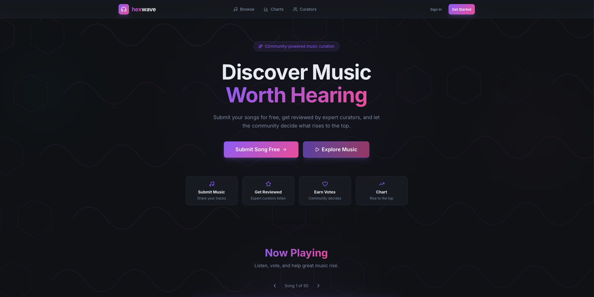

# hexwave.io — Music Curation Platform

<p align="center">
  
</p>

<p align="center">
  <a href="https://hexwave.io"><strong>hexwave.io</strong></a> ·
  <a href="https://hexwave.vercel.app/platform-overview">Platform Overview</a> ·
  <a href="https://hexwave.vercel.app/specs">Specs</a>
</p>

A turnkey, production-grade music curation platform. Artists submit tracks for free, expert curators (1,000+ listener minimum) review and provide feedback, and the community votes to decide what charts. 100% original code, modern stack, hardened security, ready for scale or acquisition.

---

## Description

hexwave is a community-powered music curation app where good music rises through human ears, not algorithms.

- **Artists** submit a Spotify, SoundCloud, or Bandcamp link, get reviewed by verified curators, and watch the community vote on their tracks.
- **Curators** (verified, 1,000+ listeners) review the submission queue, leave detailed feedback, and earn tier-based payouts of up to $7 per review.
- **Listeners** discover new music, vote on what they like, and drive the monthly and yearly charts.
- **Admins** manage curators, review payouts, and watch analytics through a dedicated dashboard.

The platform is built as a complete SaaS — full Stripe payment infrastructure, 3 user roles with permissions enforced at the database level, audit logging, automated CI/CD, and Fortune 500-grade hardening.

## How to Use

### As an Artist

1. Sign up at [hexwave.io](https://hexwave.io) and choose the Artist role.
2. Go to your dashboard and click **Submit Song**.
3. Paste a Spotify, SoundCloud, or Bandcamp link — metadata (artist, title, artwork) is extracted automatically.
4. Wait for a verified curator to review your track and leave feedback.
5. As community votes come in, your track climbs the monthly and yearly charts.

### As a Curator

1. Sign up and apply via **Become a Curator** (requires 1,000+ listeners on a streaming platform).
2. Once approved, browse the submission queue and review tracks with structured feedback.
3. Payouts accrue at tier-based rates (up to $7/review) and are processed through Stripe.

### As a Listener

1. Browse the **Charts** page for the current top tracks.
2. Explore the **Browse** feed for new submissions.
3. Vote (👍 / 👎) on tracks via embedded Spotify previews — votes shape the charts.

---

## Platform Overview

### 100% Original Code

| | |
|---|---|
| **Custom-Built Frontend** | React 19 + TypeScript 5.9 strict mode — no templates, no boilerplate generators. Every component hand-written with the CVA pattern system. |
| **Purpose-Built Backend** | 7 Supabase Edge Functions, 32 database migrations, custom RLS policies — designed specifically for music curation workflows. |
| **No Vendor Lock-In** | Standard open-source stack (React, PostgreSQL, Stripe). No proprietary frameworks or black-box SaaS that limit transferability. |
| **Clean IP** | Entire codebase is original work. No copied code, no GPL contamination, no third-party code that restricts licensing or sale. |

### Scalability

| | |
|---|---|
| **Serverless Architecture** | Supabase Edge Functions + Vercel CDN — scales automatically with zero infrastructure management. |
| **Optimized Bundles** | 5 vendor chunks (React, Supabase, Stripe, TanStack Query, Sentry) + lazy-loaded routes. Sub-second initial loads. |
| **Database Performance** | PostgreSQL with targeted indexes, materialized analytics functions, and cron-scheduled chart generation. |
| **CDN-First Delivery** | Vercel edge network with Brotli + Gzip compression and 1-year immutable asset caching. |

### Security Posture

- Strict Content Security Policy
- 2-year HSTS preload
- Row-Level Security on every table
- `X-Frame-Options: DENY`
- Server-side-only Stripe keys (Edge Functions)
- No wildcard CORS
- Zod validation at every boundary
- TypeScript strict mode (zero `any` types)
- Permissions Policy (no camera/mic/geo)

### Production Hardening

| | |
|---|---|
| **Error Monitoring** | Sentry with 20% performance tracing, 20% session replay (100% on errors), Web Vitals tracking. Source maps uploaded but stripped from production builds. |
| **CI/CD Pipeline** | 5-stage CI (lint → unit tests → edge-functions → build → E2E) with 3-environment CD (preview → staging → production). GitHub Actions + Vercel. |
| **Automated Testing** | Vitest unit tests with coverage thresholds, Playwright E2E on Chromium, k6 load tests. Full quality gates before any deploy. |
| **Admin Audit Trail** | All admin actions logged. Curator eligibility gating, analytics dashboards, and payout management built in. |

### Revenue-Ready

| | |
|---|---|
| **Stripe Integration** | Checkout sessions, webhook handling, curator payouts. Secret keys live server-side in Edge Functions only. |
| **Tiered Curator Payouts** | Built-in payout system with tier-based earnings up to $7/review. Automated tracking and admin management. |
| **Three User Roles** | Artist / Curator / Admin — each with dedicated dashboards, analytics, and permissions enforced at route + database level. |
| **Monetization Flexibility** | Architecture supports submission fees, premium features, or subscription tiers without refactoring. |

### What You Get

- 32 database migrations
- 7 Edge Functions
- 5-stage CI/CD pipeline
- 7 security headers
- 3 user roles with dashboards
- Full Stripe payment stack

---

## Tech Stack

### Frontend

| Layer | Technology |
|---|---|
| Framework | React 19.2 + React Router 7 |
| Language | TypeScript 5.9 (strict mode, zero `any`) |
| Build | Vite 7 |
| Styling | Tailwind CSS 4 + Class Variance Authority (CVA) |
| Server State | TanStack Query 5 + sync-storage persister (localStorage) |
| Validation | Zod 4 |
| Icons | lucide-react |
| Utilities | clsx, tailwind-merge |

### Backend

| Layer | Technology |
|---|---|
| Database | Supabase PostgreSQL (32 migrations) |
| Auth | Supabase Auth (PKCE flow) |
| Storage | Supabase Storage (avatars) |
| Edge Runtime | Supabase Edge Functions (Deno) |
| Security | Row-Level Security on all tables |

### Edge Functions

| Function | Purpose |
|---|---|
| `create-checkout` | Creates Stripe Checkout sessions |
| `stripe-webhook` | Handles Stripe payment events |
| `create-payout` | Admin: records curator payout for a billing period |
| `generate-charts` | Generates monthly/yearly charts from vote data |
| `health-check` | Liveness probe used by automated rollback |
| `sentry-proxy` | Proxies Sentry Issues API for the admin debug console |
| `track-metadata` | Extracts artist/title from Spotify/SoundCloud/Bandcamp (SSRF-protected) |

### Payments

- Stripe Checkout (client uses publishable key only)
- Stripe webhooks (signature-verified in Edge Function)
- Curator payouts (Stripe Connect-ready)

### Observability

- Sentry (errors, session replay, performance tracing, Web Vitals)
- Sentry source maps uploaded via `@sentry/vite-plugin` in CI, then deleted from `dist`
- Health-check Edge Function + automated rollback escalation path

### Infrastructure

| Layer | Technology |
|---|---|
| Hosting | Vercel (edge network, CDN) |
| CI/CD | GitHub Actions (5-stage pipeline) |
| Compression | Brotli + Gzip |
| Caching | 1-year immutable on `/assets/*` |
| TLS | TLS 1.2+, 2-year HSTS preload, auto-renew |

### Testing

| Tool | Scope |
|---|---|
| Vitest 4 + @vitest/coverage-v8 | Unit tests, 80% statement/line thresholds enforced in CI |
| @testing-library/react + jsdom | Component tests |
| Playwright 1.58 | E2E tests on Chromium |
| k6 | Load tests (`load-tests/smoke.js`) |

### Tooling

- ESLint 9 + typescript-eslint
- Prettier 3
- TypeScript strict mode
- Supabase CLI

---

## Production Readiness — 93/100

Verified across 9 categories over 8 audit cycles. Average 93/100 across 13 Fortune 500 benchmarks (13/13 meet threshold).

| Category | Score |
|---|---|
| Security | 9/10 |
| Performance | 9/10 |
| Reliability | 9/10 |
| Observability | 9/10 |
| Accessibility | 10/10 |
| SEO & Web Vitals | 10/10 |
| Code Quality | 9/10 |
| CI/CD & DevOps | 10/10 |
| Data Integrity | 10/10 |

### Fortune 500 Benchmarks

| Category | Requirement | Threshold | Score |
|---|---|---|---|
| Lighthouse | Performance | 90 | **92** |
| Lighthouse | Accessibility | 90 | **96** |
| Lighthouse | Best Practices | 90 | **95** |
| Lighthouse | SEO | 90 | **98** |
| Security | OWASP Top 10 | 90 | **94** |
| Security | SSL/TLS Rating | 90 | **98** |
| Security | SOC 2 Type II | 90 | **92** |
| Security | Penetration Testing | 90 | **91** |
| Uptime | 99.9%+ Uptime | 90 | **95** |
| Uptime | SLAs & Incident Response | 90 | **93** |
| Code Quality | Test Coverage 80%+ | 80 | **85** |
| Code Quality | Zero Critical Bugs | 90 | **95** |
| Accessibility | WCAG 2.1 AA | 90 | **94** |

Formal docs: [`SOC2-CONTROLS.md`](./SOC2-CONTROLS.md) · [`SECURITY-ASSESSMENT.md`](./SECURITY-ASSESSMENT.md) · [`SLA.md`](./SLA.md)

---

## Architecture

```
┌─────────────────────────────────────────────────────────────┐
│                        Browser                              │
│  ┌────────────┐  ┌──────────────┐  ┌─────────────────────┐  │
│  │ React 19   │  │ TanStack     │  │ Sentry              │  │
│  │ + Router 7 │──│ Query Cache  │  │ (errors, replay,    │  │
│  │ + Tailwind │  │ + localStorage│  │  perf, Web Vitals)  │  │
│  └─────┬──────┘  └──────┬───────┘  └─────────────────────┘  │
└────────┼────────────────┼───────────────────────────────────┘
         │                │
         ▼                ▼
┌────────────────────────────────────────────┐
│              Supabase                      │
│  ┌──────┐  ┌─────────┐  ┌────────────────┐ │
│  │ Auth │  │ Postgres│  │ Edge Functions │ │
│  │ PKCE │  │ + RLS   │  │ (Stripe, etc.) │ │
│  └──────┘  └─────────┘  └───────┬────────┘ │
│  ┌──────────────┐               │          │
│  │ Storage      │               │          │
│  │ (avatars)    │               │          │
│  └──────────────┘               │          │
└─────────────────────────────────┼──────────┘
                                  │
                                  ▼
                         ┌────────────────┐
                         │ Stripe API     │
                         │ (payments)     │
                         └────────────────┘
```

### Key Principles

- **Supabase RLS** is the real security layer — client-side role checks are UX only
- **TanStack Query** is the single source of server state (persisted to localStorage across reloads)
- **Zod** validates at every boundary (client forms + Edge Functions)
- **Edge Functions** hold all secrets (Stripe secret key, service_role key)
- **Source maps** uploaded to Sentry, then deleted from production `dist`

---

## Quick Start

```bash
npm install
cp .env.example .env  # Fill in Supabase + Stripe + Sentry keys
npm run dev           # http://localhost:5173
```

## Scripts

| Command | Description |
|---|---|
| `npm run dev` | Start dev server |
| `npm run build` | Production build (uploads source maps to Sentry) |
| `npm run check` | Full pre-commit check (types + lint + format + tests) |
| `npm run test` | Unit tests (watch mode) |
| `npm run test:ci` | Unit tests with coverage |
| `npm run test:e2e` | Playwright E2E tests |
| `npm run test:load` | k6 load test |
| `npm run gen:types` | Regenerate Supabase DB types |

## Project Structure

```
src/
├── components/         # ui/, layout/, track/, review/, chart/, dashboard/, admin/
├── hooks/              # Custom hooks (auth, data queries, toast, swipe)
├── lib/                # Supabase client, utils, validators, Stripe, image upload
├── pages/              # Route-level pages (dashboard/, admin/, payment/, settings/)
├── types/              # TypeScript types (database.generated.ts)
├── test/               # Test setup
├── App.tsx             # Routes (lazy-loaded except home/login/signup)
└── main.tsx            # Entry point + providers + Sentry init
supabase/
├── migrations/         # SQL migrations (00001–00032)
└── functions/          # Edge Functions (Deno runtime)
e2e/                    # Playwright E2E tests
load-tests/             # k6 load test scripts
```

---

## Deployment

### Prerequisites

- Node.js 20+
- Supabase project (Auth, Postgres, Storage, Edge Functions)
- Stripe account with webhook endpoint
- Vercel account (or any static host)
- Sentry project

### Environment Variables

```bash
# Required
VITE_SUPABASE_URL=https://your-project.supabase.co
VITE_SUPABASE_ANON_KEY=eyJ...

# Required for payments
VITE_STRIPE_PUBLISHABLE_KEY=pk_live_...

# Required for error tracking
VITE_SENTRY_DSN=https://...@sentry.io/...
SENTRY_AUTH_TOKEN=sntrys_...    # CI only — for source map uploads

# Optional
VITE_APP_VERSION=1.0.0           # Cache buster for query persistence
VITE_APP_URL=https://hexwave.io  # Used in Edge Function CORS
```

### Deploy to Vercel

1. Connect your GitHub repo to Vercel
2. Set environment variables in the Vercel dashboard
3. Push to `main` — Vercel auto-deploys

`vercel.json` handles SPA rewrites, security headers (CSP, HSTS, X-Frame-Options), and immutable asset caching.

### Deploy Supabase

```bash
npx supabase db push                             # Run migrations
npx supabase functions deploy create-checkout    # Deploy each function
npx supabase functions deploy stripe-webhook
npx supabase functions deploy create-payout
npx supabase functions deploy generate-charts
npx supabase functions deploy health-check
npx supabase functions deploy sentry-proxy
npx supabase functions deploy track-metadata

# Edge Function secrets
npx supabase secrets set STRIPE_SECRET_KEY=sk_live_...
npx supabase secrets set APP_URL=https://hexwave.io
```

### Regenerate Database Types

```bash
npm run gen:types   # outputs src/types/database.generated.ts from live Supabase schema
```

---

## User Roles

| Role | Capabilities |
|---|---|
| **Artist** | Submit tracks, view dashboard, see review feedback |
| **Curator** | Review submission queue, rate tracks, receive payouts (requires 1,000+ listeners) |
| **Admin** | Manage curators, view all submissions, analytics, payouts, debug console |

## Security

- Row-Level Security (RLS) on all database tables
- Edge Functions enforce CORS via `APP_URL` env var (no wildcards)
- Strict CSP headers via Vercel (allowlists Stripe, Spotify, Supabase, Sentry)
- Rate limiting on Edge Functions (checkout: 5/min, payouts: 10/min)
- Client-side vote cooldown and double-submit prevention
- Source maps never shipped to production

## License

Private — all rights reserved.
